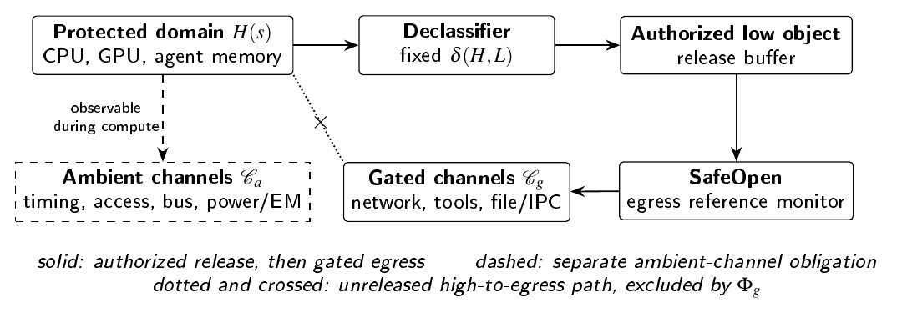
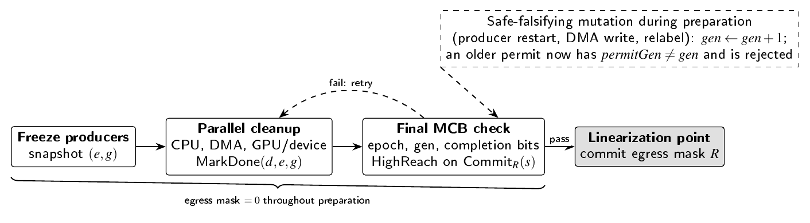

# Memory-Egress Cryptographic Interlock (MECI)

[](https://doi.org/10.5281/zenodo.23109676)

[](https://github.com/codethor0/meci/releases/tag/v1.0.0)
[](https://creativecommons.org/licenses/by/4.0/)
[](LICENSE)
[](https://orcid.org/0009-0001-6573-385X)

**A Hardware-Enforced Capability-Separation Model for AI Memory Security**

**Thor Thor**<br>
Independent Open-Source Researcher, [THOR-SEC](https://codethor0.github.io/thor-sec/)<br>
ORCID: [0009-0001-6573-385X](https://orcid.org/0009-0001-6573-385X)

> An AI agent that holds readable protected memory and an open path out of the trust boundary at the same time can leak that memory, whatever its instructions say. MECI makes that combination unreachable by construction.

This research was conducted independently on the author's own time and is not sponsored by, affiliated with, or representative of any employer.

## Overview

MECI is a capability-separation pattern intended for hardware enforcement. It requires that no enabled gated egress channel (network, tool call, file or IPC export) is reachable from unreleased protected information. Reachability is defined over a state-dependent influence graph, egress is enabled only by a generation-checked, linearizable `SafeOpen` operation evaluated on the post-commit configuration, and protected epochs are bound to keys that cannot be resurrected after revocation.

The paper separates what is proved, what is checked, and what is proposed. Gated-egress safety and epoch non-resurrection are proved under stated obligations. A counterexample shows why those safety results alone do not imply noninterference, and a conditional noninterference theorem modulo an explicit release function shows what does. The finite safety core is specified in TLA+ and checked exhaustively within stated bounds. No current confidential-computing platform is claimed to implement MECI.



## Core Contributions

| Area | Contribution |
| --- | --- |
| Gated-egress invariant | Reflexive-transitive reachability over a state-dependent influence graph, with an explicit labeling rule for sealed objects |
| Channel model | Gated channels a monitor can disable, separated from ambient channels (timing, access patterns, memory bus) that need their own proof |
| SafeOpen | Generation-checked, linearizable commit evaluated on the post-commit configuration; stale safety snapshots are rejected |
| Safety proofs | Gated-egress safety from two local obligations, projection refinement, epoch non-resurrection |
| Noninterference | Counterexample to "mutual exclusion implies noninterference", then a theorem modulo authorized release in which the MECI invariant carries the gated-output step |
| AI agent policy | A concrete release function for an incident-triage agent; LLM output stays high until verified |
| Reproducibility | TLA+ specification checked by TLC, plus an independent reference checker with exactly matching state counts |
| Refinement | Arm CCA/RMM path, Intel TDX and AMD SEV-SNP obligations, NVIDIA Hopper GPU quiescence contract |

## SafeOpen Transaction



## Model Checking Results

Exhaustive within `GenBound = 3`, `MaxEpoch = 3`. TLC 2.19 and the reference checker report identical values.

| Design | Distinct states | Violating states | Shortest counterexample |
| --- | ---: | ---: | --- |
| Atomic SafeOpen | 705 | 0 | none |
| Generation-checked split | 858 | 0 | none |
| Unversioned split | 938 | 70 | 10 steps: check, restart producer, open on stale permit |
| D/P-only guard | 980 | 275 | 3 steps: open with other hazards present |
| Guard omitting B | 712 | 7 | 7 steps: open with a staged export object |

## Reproduce

```bash
# Reference checker (Python 3.8+, no dependencies)
python3 scripts/meci_modelcheck.py

# TLC (tested with TLA+ Tools v1.7.4 / TLC 2.19)
# Download tla2tools.jar from https://github.com/tlaplus/tlaplus/releases/tag/v1.7.4
java -cp tla2tools.jar tlc2.TLC -deadlock -config spec/MECI_atomic.cfg spec/MECI.tla
java -cp tla2tools.jar tlc2.TLC -deadlock -config spec/MECI_gencheck.cfg spec/MECI.tla
java -cp tla2tools.jar tlc2.TLC -deadlock -continue -config spec/MECI_buggy.cfg spec/MECI.tla
java -cp tla2tools.jar tlc2.TLC -deadlock -continue -config spec/MECI_dponly.cfg spec/MECI.tla
java -cp tla2tools.jar tlc2.TLC -deadlock -continue -config spec/MECI_noB.cfg spec/MECI.tla
```

Captured outputs are in `scripts/meci_modelcheck_results.txt` and `spec/tlc_results.txt`. SHA-256 digests of the reproducibility artifacts are listed in Appendix A of the paper.

## Repository Layout

| Path | Contents | License |
| --- | --- | --- |
| `paper/MECI.pdf` | The paper | CC BY 4.0 |
| `paper/meci.tex` | LaTeX source | CC BY 4.0 |
| `paper/abstract.txt` | Abstract | CC BY 4.0 |
| `docs/figures/` | Figures used in this README | CC BY 4.0 |
| `spec/` | TLA+ specification, TLC configurations, captured TLC output | MIT |
| `scripts/` | Reference checker and captured output | MIT |

## Related Work by the Author

- Mission-Invariant Architecture Morphing (MIAM), [doi:10.5281/zenodo.23001045](https://doi.org/10.5281/zenodo.23001045). MECI applies MIAM's cryptographic epoch discipline to the memory-egress boundary.
- Attack Calculus (ACN), [doi:10.5281/zenodo.23092790](https://doi.org/10.5281/zenodo.23092790). MECI's rogue-agent analysis is an instance of ACN's separation of influence from authority.

## Citation

See [`CITATION.cff`](CITATION.cff). The Zenodo DOI is added at release.

## History

The concepts were first shared publicly on 10 August 2026. Version 1.0.0 is the archival release; see [`CHANGELOG.md`](CHANGELOG.md) for what changed.
